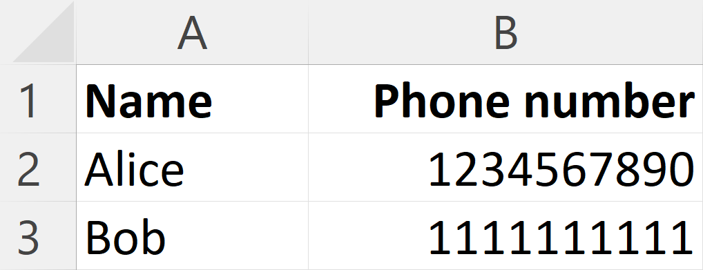
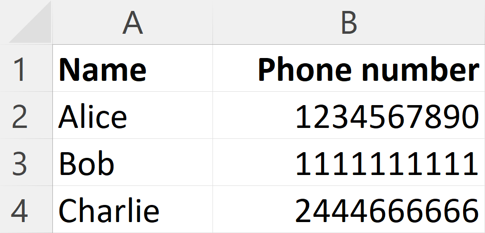
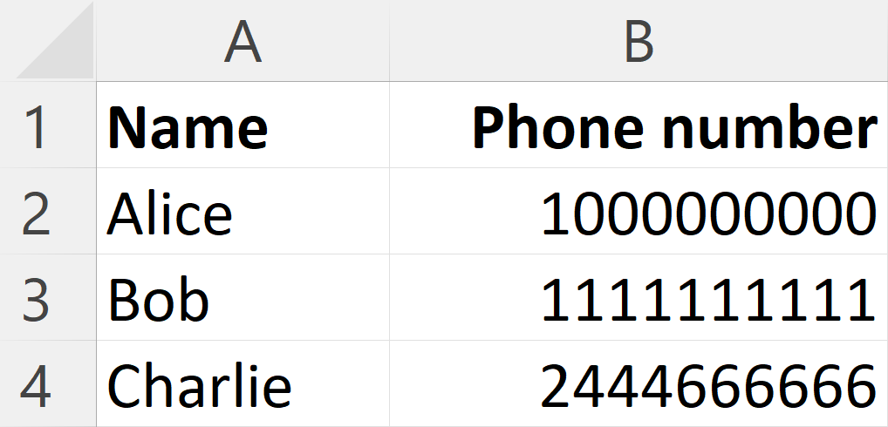
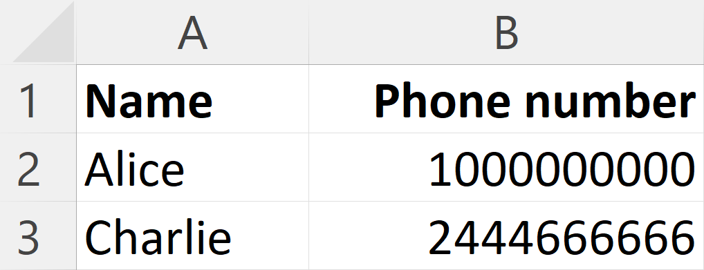
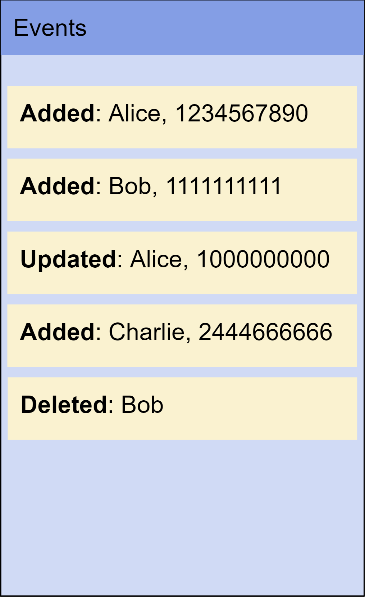
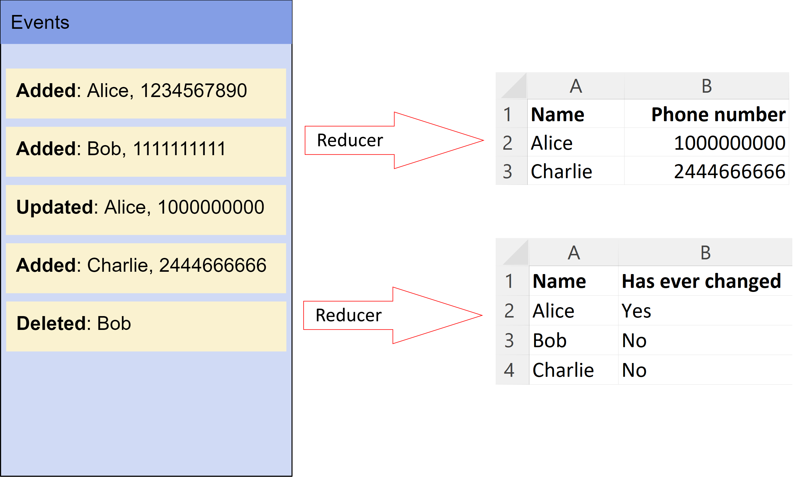

# Quick introduction to event sourcing and CQRS

Event sourcing is a pattern for modelling a database, i.e. creating database schemas, and it is an alternative to the CRUD pattern. Let's compare the two by using as an example a simple phone book application: for every contact in the phone book, we want to store their name and their phone number.

## CRUD
CRUD stands for **C**reate, **R**etreive, **U**pdate and **D**elete. It is by far the most common way in which most software teams think about their database today.

  
  The data is organised in tables with rows (objects) and columns (keys)

  
  We can <b>create</b> a new row

  
  We can <b>update</b> cells in an existing row

  
  We can <b>delete</b> a row

When we want to **retrieve** data, we run a *select* query on a table using a *where* clause to determine which rows we need.

## Event sourcing

With event sourcing we model our data as a series of immutable **events**, also called **facts**. Each event represents a specific change or action that has occurred within the system. For example, instead of storing Alice's current phone number, we store instead all the events that caused this number to be set.

We persist the events in a database table called *event-store*, which serves as the single source of truth for the application's data.

The events are *immutable*. We never update or delete them. Even for deleting, we add a new delete row in the database.

To get the current state we *replay* the events. A function, called **reducer**, will go through the list of all the events in the sequence that they were recorded to produce the current state, in this example the current list of our contacts.

## CQRS

CQRS stands for **C**ommand **Q**uery **R**esponsibility **S**eparation, and in plain terms it means that we use one database table to write our data and a different table to query the data. Obviously there needs to be a mechanism in place to make sure that the two tables are synchronised.

In an event-sourcing system that uses CQRS, we write data only in the *event store* table. Then there is one or more *reducer* functions that process the events and store the result in *read view* collections, which are used to query the data.

Note that for a single *write* table we can have multiple *read* views. This would be needed in cases where a different schema improves performance or allows for simpler read queries.

The *event store* table is the single source of truth for the database. We can delete all the read views, reply the events and thus rebuild all the read views.

CQRS and event-sourcing are related terms, but they are not the same pattern. We could implement one without the other. However the `fact-streams` library is used to implement them in combination.

## Benefits of event sourcing

There are several advantages that event sourcing has over the CRUD pattern:

- **Business insights**: You capture not just the final state, but also the sequence of events leading to that state. This information allows you to retrospectively run reports that are impossible to build in a CRUD system.
- **Complete audit trail**: By maintaining a full historical record of all events that have occurred you can track how data evolved over time and who initiated each change.
- **Performance, scalability and simplicity**: You can optimise read and write operations independently. You can even create multiple read views per store, that are optimised for different query patterns. Your queries become faster to run but also simpler to write and maintain.
- **Flexibility and evolution**: You can easily evolve the system's data model and business logic over time. You can add new event types, update existing ones, and introduce new behaviour without losing historical data and without implementing complex migrations.
- **Temporal querying**: You can replay events to recreate the system's state at any specific moment in time. This capability is valuable for debugging, troubleshooting, and analyzing past states.

## Further reading

You can learn more about event-sourcing in this [talk](https://www.youtube.com/watch?v=8JKjvY4etTY) by Greg Young, which is an excellent introduction to key concepts and it has been the inspiration for building `fact-streams``. This [talk](https://www.youtube.com/watch?v=ck7t592bvBg) by Martin Fowler and this [guide](https://www.eventstore.com/event-sourcing) are also very good sources of information.

