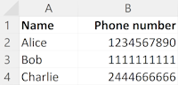

# Test what style markdown GitHub can render

## With CCS styles

  
  We can <b>create</b> a new row

## Left aligned

The data is organised in tables with rows (objects) and columns (keys):

We can **create** a new row:

We can <b>update</b> cells in an existing row:

## Inline CSS

  
  We can <b>create</b> a new row

## A float

We can **create** a new row

## Inline

 We can **create** a new row

## Inline with vertical align

 We can **create** a new row

### With list items

- We can **create** a new row

- We can **create** a new row

- We can **create** a new row

- We can **create** a new row

